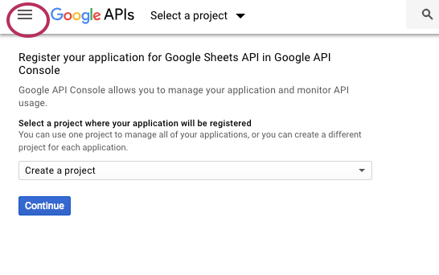
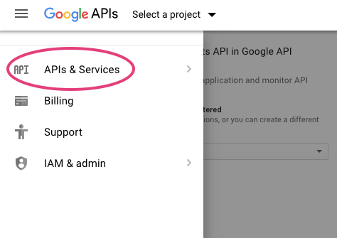
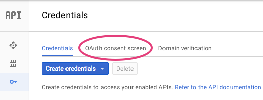

# Working with GSheets

## A walking through the process

In this walk through we will create some data in a Google Sheet, import it into a collection
we've created. Modify it and send it back to our Google Sheet. As part of the procees we will
need to authorize our _dataset_ tool and setup access.

### Setup a local collection

Setup our local collection. Create a new dataset collection named "ZBS-Character-List.ds"

```shell
    dataset init zbs-cast-list.ds
```

Download [zbs-cast-list.csv](zbs-cast-list.csv).  We will use this when we create our
Google Sheet for this walk through.

### Setting up our Google Sheet

Open your browser and create a new Google Sheet by going to https://sheets.google.com. You 
can pick the "Blank" sheet from the template gallery under "Start a new spreadsheet". 
This should you a new untitled spreadsheet.  Set the title to something meaninful, I'm 
going to set my title to "zbs-cast-list".

### loading some sample data

In Google Sheets go to the file menu and select "import".  Select the "upload" tab, find 
_zbs-cast-list.csv_ and "open" it. You should then see an "Import file" dialog, select 
"Replace current sheet" then press "Import Data" button at the bottom of the box.

You should wind up with a spreadsheet that starts out something like this --

```csv
    id,name,title,year
    1,Jack Flanders,The Fourth Tower of Inverness,1972
    2,Little Freida,The Fourth Tower of Inverness,1972
    3,Dr. Mazoola,The Fourth Tower of Inverness,1972
    4,The Madonna Vampyra,The Fourth Tower of Inverness,1972
    5,Chief Wampum,The Fourth Tower of Inverness,1972
    6,Old Far-Seeing Art,The Fourth Tower of Inverness,1972
    7,Lord Henry Jowls,The Fourth Tower of Inverness,1972
    8,Meanie Eenie,The Fourth Tower of Inverness,1972
    9,Lady Sarah Jowls,The Fourth Tower of Inverness,1972
    ...
```

You sheet should have four columns A to D (id, name, title, year) and 195 rows
with id ranging from 1 to 194 in column 1. You can describe the range of your sheet as
A1:D195 (A 1 through D 195). We're going to use this range when importing and exporting.


### Finding your sheet's ID and sheet name

Look at the URL for your Google Sheet. It'll be similar to mine

```
    https://docs.google.com/spreadsheets/d/1Rf-fbGg9OPWnDsWng9oyQmMIWzMqx717uuKeBlzDaCc/edit#gid=0
                                           ^^^^^^^^^^^^^^^^^^^^^^^^^^^^^^^^^^^^^^^^^^^^
```

Notice the part of the URL between "/d/" and "/edit". For my sheet it is 
"1Rf-fbGg9OPWnDsWng9oyQmMIWzMqx717uuKeBlzDaCc". This is the sheet ID. It is unique to my spreadsheet
so yours will be different. We are going to need that number later.

Look at the bottom of the Google Sheet window. You'll see the tab for your sheet. By default this
is named "Sheet1". You'll also need to know this name.

### Setting up authorization to access your Google Sheet

This is the hardest part of the process. Google sometimes updates this procedure. These are
the steps I took on 05/29/2018. You might have to make adjustments in the future.

We need to get some credentials and authorization keys to access your Google Sheet
before we can import it into our dataset collection.  If you have not done this previously go to 
https://developers.google.com/sheets/api/quickstart/go. Our goal is to complete "Step 1". 
As of today, 05/29/2007, the instructions are a touch confusing.
In the letter "a" section you click "this wizard" link. 
This should open a new window/tab in your browser. We'll be referring back to "Step 1" 
page for letters "b" to "h".

The instructions under "Step 1" letter "a" say to continue to "Go to credentials" 
but it isn't visible on the page. You need to click on the page's pull out menu (the three horizontal 
lines in the upper right of the page, sometimes referred to as a "hamburger" menu).



Click the menu.  Then click "APIs & Services". 



Now click the key symbol 



and you can follow the instructions starting at letter "c" and continuing through "h".


### Authorizing dataset access

Once your "client_secret.json" file is generated and downloaded to your working directory
you need to trigger authorization for _dataset_. To do so we type in for importing our spreadsheet
into our local collection.  The first time we do this a link (URL) will be displayed. Copy that
link into your web browser. You will goto a page that allows you to "authorize" the application.
Follow the instructions.

    NOTE: The "client_secret.json" file and OAuth authorization is required for data to access your 
    Google Sheet.  The OAuth authorization process uses the "client_secret.json" file to 
    get a token to use on subsequent access by _dataset_. This OAuth token is 
    usually stored in your `$HOME/.credentials` directory as sheets.googleapis.com-dataset.json.
    If this file doesn't exist then the first time you run the _dataset_ command with a GSheet option 
    it'll prompt you to use your web browser to authorize _dataset_ to access your Google spreadsheet.

The command that will trigger the authorization process the first time is also the command we will
eventually use to import our data. Replace SHEET_ID with the number we see in the URL and SHEET_NAME
with the name of the spreadsheet. Our CELL_RANGE will be "A1:D195" and our COL_NP_FOR_ID will be 1

```shell
    dataset zbs-cast-lis.ds import-gsheet SHEET_ID SHEET_NAME CELL_RANGE COL_NO_FOR_ID
```

For my URL, SHEET_ID, SHEET_NAME, CELL_RANGE and COL_NO_FOR_ID looked like

```shell
    dataset zbs-cast-lis.ds import-gsheet "1Rf-fbGg9OPWnDsWng9oyQmMIWzMqx717uuKeBlzDaCc" "Sheet1" "A1:D192" 1
```

Yours will have a different SHEET_ID.

After your authorize the sheet access via your web browser then next time you run the command you'll
see data imported into _zbs-cast-list.ds_. You can count the keys to see what was imported.

```shell
    dataset zbs-cast-list.ds count
```

You are now ready to modify and update your local collection.

## Exporting a collection to a Google Sheet

To send our collection data to a Google sheet the sheet needs to exist already. Note that writing
to the Google Sheet our data will replace (overwrite) all the rows in the CELL_RANGE we provide.
This means any sorting column ordering changes will be overwritten by the cells we're writing.

This command to export our collection into Google sheets looks like

```shell
    dataset COLLECTION_NAME export-gsheet SHEET_ID SHEET_NAME CELL_RANGE FILTER_EXPR FIELDS_TO_EXPORT [COLUMN_NAMES]
```

Notice FILTER_EXPR, FIELDS_TO_EXPORT and COLUMN_NAMES. A FILTER_EXPR is an expression that selects which records are uploaded
from the collection. If you want the whole collection then include the word "true". If you wanted only rows for
year 1982 then the expression would look like "(eq .year 1982)".  For this example just use true so we export all records
as rows in our spreadsheet. FIELDS_TO_EXPORT are the [dotpath](../docs/dotpath.html) into our records and the COLUMN_NAMES
are the column names that will be written in first row of our exported records.

My export command looks like

```shell
    dataset zbs-cast-lis.ds export-gsheet "1Rf-fbGg9OPWnDsWng9oyQmMIWzMqx717uuKeBlzDaCc" "Sheet1" "A1:D192" true ".id,.name,.title,year" "ID,Name,Title,Year"
```

If you look at your spreadsheet you should see the updated spreadsheet.


Related topics: [dotpath](../docs/dotpath.html), [export-csv](../docs/export-csv.html), [import-csv](../docs/import-csv.html), [import-gsheet](../docs/import-gsheet.html) and [export-gsheet](../docs/export-gsheet.html)

